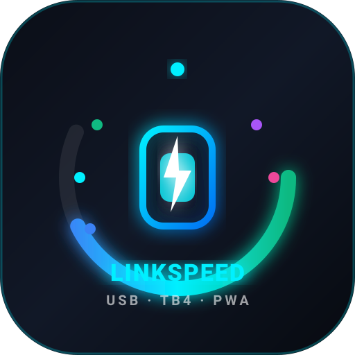

# ⚡ LinkSpeed Pro

> **USB Cable Negotiated Speed & Hardware Link Inspector (PWA)**  
> Inspect physical USB negotiated link speeds, detect charge-only cable bottlenecks, and explore complete hardware topology trees just like macOS System Report.



---

## 🚀 Quick Start

Ensure Node.js (v18+) is installed, then start the local engine:

```bash
# Navigate to project directory
cd /home/robert/Projects/active-link-speed

# Start the native bridge & PWA server
npm start
# or: ./start.sh
```

Then open your browser to:
👉 **[http://localhost:4321](http://localhost:4321)**

---

## 🎯 How to Test a USB Cable for Speed & Bottlenecks

1. **Open the Cable Workbench**: Go to `http://localhost:4321` in your browser.
2. **Connect a Fast Peripheral**: Take a high-speed external USB-C SSD (e.g., Samsung T7, SanDisk Extreme, NVMe enclosure) or USB 3.x drive.
3. **Plug It In Using the Mystery Cable**: Plug the peripheral into your computer using the USB-C cable you want to test.
4. **Instant Link Analysis**:
   - **Full Speed (10 Gb/s or 5 Gb/s)**: The app chimes and confirms:  
     `⚡ Optimal Speed Verified: 10 Gb/s SuperSpeed+ (Gen 2). High-speed data lanes verified.`
   - **Bottleneck (480 Mb/s)**: If your 10 Gb/s SSD only negotiates at 480 Mb/s, LinkSpeed Pro highlights a high-visibility warning:  
     `🚨 USB Cable Bottleneck Detected! Hardware reports USB 3.2 capability, but negotiated at only 480 Mb/s. Your cable is a charge-only cable without SuperSpeed data lines!`

---

## 💻 Features

- **Real-Time Sub-Second Hotplug Detection**: Streams live hardware events via Server-Sent Events (SSE). Plugging or unplugging a cable triggers instant UI updates and audio chimes.
- **Dynamic Speedometer Gauge**: Visual representation of physical link speed across all tiers:
  - ⚡ **40 Gb/s**: USB4 / Thunderbolt 4
  - 🟣 **20 Gb/s**: USB 3.2 Gen 2x2
  - 🔵 **10 Gb/s**: USB 3.2 Gen 2 (SuperSpeed+)
  - 🟢 **5 Gb/s**: USB 3.2 Gen 1 (SuperSpeed)
  - 🟡 **480 Mb/s**: USB 2.0 (High-Speed / Charge Cable)
  - ⚪ **12 Mb/s / 1.5 Mb/s**: Full-Speed & Low-Speed peripherals
- **macOS System Report Tree**: Full hierarchical tree of Host Controllers, Root Hubs, External Hubs, and connected devices.
- **Deep Inspector Drawer**: Slide-over drawer with raw descriptor details:
  - Negotiated Speed vs Device Descriptor (`bcdUSB`)
  - Bus Power Draw (`bMaxPower` in mA)
  - Vendor ID (VID), Product ID (PID) with vendor lookup
  - Serial Number, Firmware Revision (`bcdDevice`)
  - Bus path, device number, sysfs location
  - One-click JSON hardware report export
- **Installable PWA**: Progressive Web App with offline service worker, custom dark-mode design, and one-click desktop app installation.
- **Built-in Cable Simulator**: Test the interface with simulated 480 Mb/s bottleneck cables and 40 Gb/s Thunderbolt drives anytime from the top bar.

---

## 🛠️ Architecture

```
┌─────────────────────────────────────────────────────────┐
│              Installable PWA Frontend                   │
│   (Cable Workbench · Speedometer · System Report Tree)   │
└───────────────────────────▲─────────────────────────────┘
                            │  SSE Stream / REST API
┌───────────────────────────┴─────────────────────────────┐
│             Local Native Bridge (server.js)             │
│            Runs locally on http://localhost:4321        │
└───────────────────────────▲─────────────────────────────┘
                            │  Kernel Hardware Queries
    ┌───────────────────────┴───────────────────────┐
    │                                               │
┌───┴─────────────────────────┐   ┌─────────────────┴─────────────────┐
│     Linux Kernel Engine     │   │        macOS Kernel Engine        │
│  /sys/bus/usb/devices/      │   │  system_profiler SPUSBDataType    │
│  /sys/bus/thunderbolt/      │   │  SPThunderboltDataType            │
└─────────────────────────────┘   └───────────────────────────────────┘
```

---

## 📄 License
MIT
