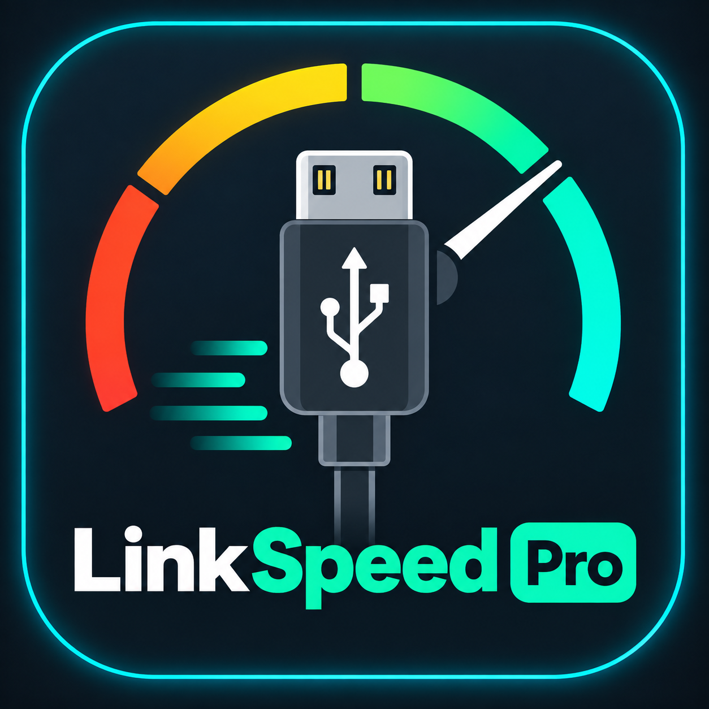

<p align="center">
  
</p>

<h1 align="center">LinkSpeed Pro</h1>

<p align="center">
  <strong>USB Cable Negotiated Speed &amp; Hardware Link Inspector (Desktop &amp; PWA)</strong><br />
  Inspect physical USB negotiated link speeds, detect charge-only cable bottlenecks, and explore complete hardware topology trees just like macOS System Report.
</p>

<p align="center">
  
  
  
  
</p>

---

## 🚀 Getting Started & Deployment Options

LinkSpeed Pro supports multiple ways to run, from 1-click standalone desktop apps (zero terminal needed) to developer CLI tools:

### 📦 1. 1-Click Desktop App (Zero Terminal Needed)

Download the latest release for your operating system from **[GitHub Releases](https://github.com/rco-Tech/linkspeed-PRO/releases)**:

#### 🍏 macOS (Apple Silicon M1/M2/M3/M4 & Intel)
1. Download **`LinkSpeed-Pro-*-arm64-mac.zip`** (for Apple Silicon) or **`LinkSpeed-Pro-*-mac.zip`** (for Intel / universal DMG).
2. Unzip and drag **`LinkSpeed Pro.app`** into your `/Applications` folder.
3. Launch from Launchpad, Spotlight, or Dock.
   > **macOS Gatekeeper Note (Unsigned App)**:  
   > Because the app is open-source and not notarized through a paid Apple Developer certificate, macOS Gatekeeper may show a warning on first launch. To open:
   > - Simply **Right-click (or Control-click)** `LinkSpeed Pro.app` in Finder and select **Open** → **Open**, or
   > - Run this one-time command in Terminal:
   >   ```bash
   >   xattr -cr "/Applications/LinkSpeed Pro.app"
   >   ```

#### 🐧 Linux (All Distributions & Architectures)
- **AppImage (Portable)**: Download `LinkSpeed-Pro-*.AppImage`, make it executable, and run:
  ```bash
  chmod +x LinkSpeed-Pro-*.AppImage
  ./LinkSpeed-Pro-*.AppImage
  ```
- **DEB (Debian, Ubuntu, Linux Mint)**: Download `linkspeed-pro_*_amd64.deb` and install:
  ```bash
  sudo dpkg -i linkspeed-pro_*_amd64.deb
  ```

---

### ⚙️ 2. Silent Background Service (For Browser / PWA Users)
If you prefer using the browser/PWA version but don't want to run terminal commands every time:
```bash
./install-daemon.sh
```
- **macOS**: Automatically registers a user `LaunchAgent`.
- **Linux**: Automatically enables a `systemd --user` service.
- *The daemon starts silently on system boot in the background (< 15MB RAM). Whenever you open `http://localhost:4321` or click your Dock PWA icon, it connects immediately!*
- *(To uninstall anytime: `./install-daemon.sh --uninstall`)*

---

### 💻 3. Run Directly via Terminal / CLI

**Zero-setup run from anywhere (no clone needed)**:
```bash
npx github:rco-Tech/linkspeed-PRO
```

**Or run from cloned repository**:
```bash
# macOS 1-click launcher: double-click LinkSpeed-Pro.command in Finder
# Or run in terminal:
./start.sh
```
Then visit: 👉 **[http://localhost:4321](http://localhost:4321)**

---

## 🎯 How to Test a USB Cable for Speed & Bottlenecks

1. **Open the Cable Workbench**: Go to `http://localhost:4321` in your browser.
2. **Connect a Fast Peripheral**: Take a high-speed external USB-C SSD (e.g., Samsung T7, SanDisk Extreme, NVMe enclosure) or USB 3.x drive.
3. **Plug It In Using the Mystery Cable**: Plug the peripheral into your computer using the USB-C cable you want to test.
4. **Instant Link Analysis**:
   - **Full Speed (10 Gb/s or 5 Gb/s)**: The app chimes and confirms:  
     `⚡ Optimal Speed Verified: 10 Gb/s SuperSpeed+ (Gen 2). High-speed data lanes verified.`
   - **Bottleneck (480 Mb/s)**: If your 10 Gb/s SSD only negotiates at 480 Mb/s, LinkSpeed Pro highlights a high-visibility warning:  
     `🚨 USB Cable Bottleneck Detected! Hardware reports USB 3.2 capability, but negotiated at only 480 Mb/s. Your cable is a charge-only cable without SuperSpeed data lines!`

---

## 💻 Features

- **Integrated About & Diagnostics Modal**: View version, author credits, active backend bridge status, live OS/kernel queries, and copy formatted system reports with 1 click.
- **WebUSB Direct Mode**: Directly query and inspect connected USB devices inside Chrome/Chromium without needing a local daemon or bridge.
- **Real-Time Sub-Second Hotplug Detection**: Streams live hardware events via Server-Sent Events (SSE). Plugging or unplugging a cable triggers instant UI updates and audio chimes.
- **Dynamic Speedometer Gauge**: Visual representation of physical link speed across all tiers:
  - ⚡ **40 Gb/s**: USB4 / Thunderbolt 4
  - 🟣 **20 Gb/s**: USB 3.2 Gen 2x2
  - 🔵 **10 Gb/s**: USB 3.2 Gen 2 (SuperSpeed+)
  - 🟢 **5 Gb/s**: USB 3.2 Gen 1 (SuperSpeed)
  - 🟡 **480 Mb/s**: USB 2.0 (High-Speed / Charge Cable)
  - ⚪ **12 Mb/s / 1.5 Mb/s**: Full-Speed & Low-Speed peripherals
- **macOS System Report Tree**: Full hierarchical tree of Host Controllers, Root Hubs, External Hubs, and connected devices.
- **Deep Inspector Drawer**: Slide-over drawer with raw descriptor details:
  - Negotiated Speed vs Device Descriptor (`bcdUSB`)
  - Bus Power Draw (`bMaxPower` in mA)
  - Vendor ID (VID), Product ID (PID) with vendor lookup
  - Serial Number, Firmware Revision (`bcdDevice`)
  - Bus path, device number, sysfs location
  - One-click JSON hardware report export
- **Installable PWA**: Progressive Web App with offline service worker, custom dark-mode design, and one-click desktop app installation.
- **Built-in Cable Simulator**: Test the interface with simulated 480 Mb/s bottleneck cables and 40 Gb/s Thunderbolt drives anytime from the top bar.

---

## 🛠️ Architecture

```
┌─────────────────────────────────────────────────────────┐
│              Installable PWA Frontend                   │
│   (Cable Workbench · Speedometer · System Report Tree)   │
└───────────────────────────▲─────────────────────────────┘
                            │  SSE Stream / REST API
┌───────────────────────────┴─────────────────────────────┐
│             Local Native Bridge (server.js)             │
│            Runs locally on http://localhost:4321        │
└───────────────────────────▲─────────────────────────────┘
                            │  Kernel Hardware Queries
    ┌───────────────────────┴───────────────────────┐
    │                                               │
┌───┴─────────────────────────┐   ┌─────────────────┴─────────────────┐
│     Linux Kernel Engine     │   │        macOS Kernel Engine        │
│  /sys/bus/usb/devices/      │   │  system_profiler SPUSBDataType    │
│  /sys/bus/thunderbolt/      │   │  SPThunderboltDataType            │
└─────────────────────────────┘   └───────────────────────────────────┘
```

---

## 📄 License
MIT
